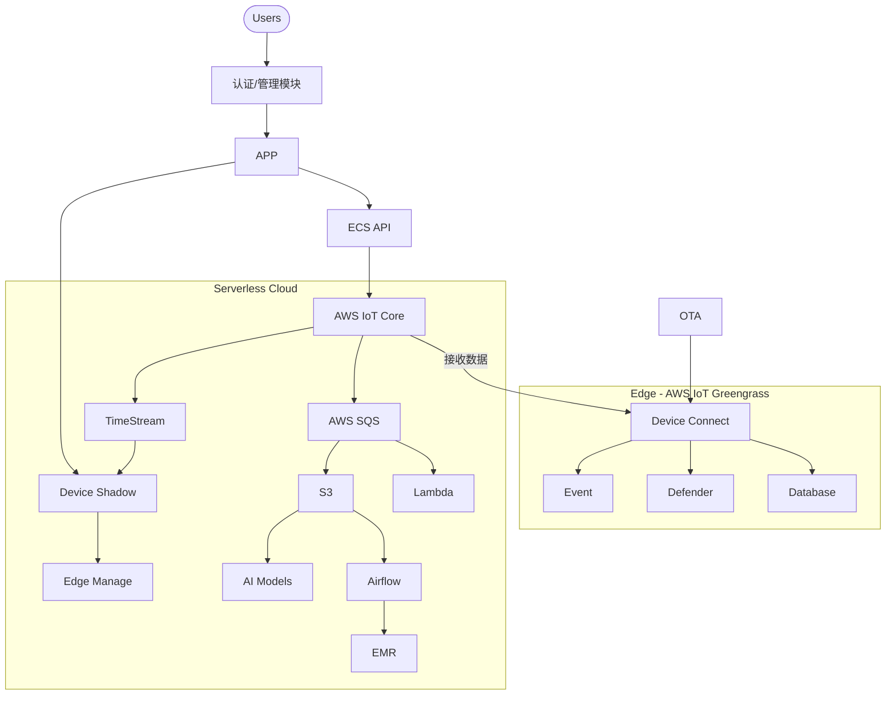

# IoT Platform Architecture

## 概述

本IoT平台是一个完整的端到端物联网解决方案，基于AWS云服务构建，支持设备连接、数据处理、用户管理、边缘计算和OTA更新等功能。

## 系统架构



## 主要功能模块

### 1. 核心数据处理管道 (IotPocStack)

- **IoT Core**: 设备连接和消息路由
- **SQS**: 消息队列，替代MSK以降低成本
- **Lambda**: 数据处理和转换
- **TimeStream**: 时序数据存储
- **S3**: 原始数据存储

### 2. 设备影子管理 (DeviceShadowStack)

- **Device Shadow**: 设备状态管理
- **DynamoDB**: 影子状态缓存
- **API Gateway**: 影子管理API
- **Lambda**: 影子操作处理

### 3. 用户认证授权 (AuthStack)

- **Cognito User Pool**: 用户认证
- **Cognito Identity Pool**: AWS资源访问
- **DynamoDB**: 用户配置文件和设备权限
- **IAM Roles**: 基于角色的访问控制

### 4. ECS API服务 (EcsApiStack)

- **ECS Fargate**: 容器化API服务
- **Application Load Balancer**: 负载均衡
- **API Gateway**: 统一API入口
- **Auto Scaling**: 自动扩缩容

### 5. OTA固件更新 (OtaStack)

- **S3**: 固件文件存储
- **IoT Jobs**: 设备任务管理
- **Step Functions**: OTA工作流编排
- **DynamoDB**: 任务状态跟踪

## 部署指南

### 前置条件

1. 安装AWS CLI和配置凭证
2. 安装AWS CDK:
   ```bash
   npm install -g aws-cdk
   ```
3. 安装Python依赖:
   ```bash
   pip install -r requirements.txt
   ```

### 部署步骤

1. **初始化CDK环境**:

   ```bash
   cdk bootstrap
   ```
2. **部署所有栈**:

   ```bash
   cdk deploy --all
   ```
3. **单独部署特定栈**:

   ```bash
   # 核心数据处理
   cdk deploy IotPocStack

   # 设备影子管理
   cdk deploy DeviceShadowStack

   # 用户认证
   cdk deploy AuthStack

   # ECS API服务
   cdk deploy EcsApiStack

   # OTA更新
   cdk deploy OtaStack
   ```

### 配置选项

在部署前，可以在 `cdk.json`中配置以下参数：

```json
{
  "context": {
    "account": "your-aws-account-id",
    "region": "us-east-1",
    "domain_name": "your-domain.com"
  }
}
```

## API端点

### 1. 设备影子管理 API

```
GET    /devices/{device_id}/shadow           # 获取设备影子
PUT    /devices/{device_id}/shadow           # 更新设备影子
DELETE /devices/{device_id}/shadow           # 删除设备影子
GET    /devices/{device_id}/shadow/{name}    # 获取命名影子
POST   /batch                                # 批量操作
```

### 2. 用户认证 API

```
GET    /users                                # 获取用户列表 (管理员)
GET    /users/{user_id}                      # 获取用户信息
GET    /users/{user_id}/permissions          # 获取用户权限
POST   /users/{user_id}/permissions/devices  # 授予设备权限
```

### 3. ECS API 服务

```
GET    /health                               # 健康检查
GET    /api/v1/devices                       # 设备列表
GET    /api/v1/devices/{device_id}           # 设备详情
POST   /api/v1/devices                       # 创建设备
PUT    /api/v1/devices/{device_id}           # 更新设备
DELETE /api/v1/devices/{device_id}           # 删除设备
```

### 4. OTA管理 API

```
GET    /firmware/versions                    # 固件版本列表
POST   /firmware/versions                    # 上传固件版本
GET    /ota/jobs                             # OTA任务列表
POST   /ota/jobs                             # 创建OTA任务
GET    /ota/jobs/{job_id}                    # 任务状态
DELETE /ota/jobs/{job_id}                    # 取消任务
```

## 安全特性

### 1. 身份认证

- Cognito用户池提供多因素认证 (MFA)
- 支持邮箱和用户名登录
- JWT token验证

### 2. 授权控制

- 基于角色的访问控制 (RBAC)
- 细粒度设备权限管理
- IAM策略最小权限原则

### 3. 网络安全

- VPC隔离
- ALB WAF保护
- HTTPS强制加密
- 私有子网部署

### 4. 数据安全

- S3服务端加密
- DynamoDB加密
- IoT Core TLS证书认证

## 监控和日志

### 1. CloudWatch指标

- Lambda执行时间和错误率
- ECS服务CPU/内存使用率
- API Gateway请求量和延迟
- IoT Core连接数和消息量

### 2. 日志收集

- Lambda函数日志
- ECS容器日志
- API Gateway访问日志
- IoT Core设备日志

### 3. 告警配置

- 错误率阈值告警
- 资源使用率告警
- 设备离线告警
- OTA失败告警

## 成本优化

### 1. 按需付费

- Lambda按执行次数付费
- ECS Fargate按资源使用付费
- DynamoDB按需计费模式

### 2. 存储优化

- S3生命周期策略
- TimeStream数据保留策略
- 日志自动清理

### 3. 网络优化

- VPC NAT Gateway优化
- CloudFront CDN缓存
- 区域内流量优化

## 扩展性考虑

### 1. 水平扩展

- ECS Auto Scaling
- Lambda并发控制
- DynamoDB自动扩容

### 2. 性能优化

- 数据库读取副本
- 缓存策略
- 批处理优化

### 3. 多区域部署

- 跨区域复制
- 灾难恢复
- 就近访问

## 故障排除

### 1. 常见问题

- 设备连接失败检查证书配置
- Lambda超时调整内存和超时设置
- API网关CORS配置检查

### 2. 调试工具

- CloudWatch Logs Insights
- X-Ray分布式跟踪
- IoT Device Defender

### 3. 性能调优

- 数据库查询优化
- Lambda冷启动优化
- 网络延迟优化

## 下一步扩展

### 1. AI/ML集成

- SageMaker模型部署
- 实时推理服务
- 异常检测算法

### 2. 边缘计算

- IoT Greengrass扩展
- 边缘ML推理
- 本地数据处理

### 3. 数据分析

- 实时仪表板
- 历史数据分析
- 预测性维护

---

本文档描述了完整的IoT平台架构设计和实现方案。通过模块化的设计，系统具有良好的可扩展性和维护性，能够满足各种规模的IoT应用需求。
