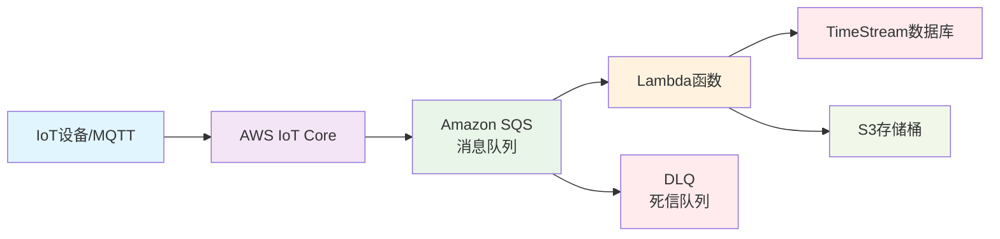

# IoT PoC - 极简物联网数据管道 (SQS版)

[](https://aws.amazon.com/iot-core/)
[](https://aws.amazon.com/sqs/)
[](https://www.python.org/)
[](https://www.rust-lang.org/)
[](https://aws.amazon.com/cdk/)

一个完整的IoT数据管道演示项目，展示了 **MQTT → IoT Core → SQS → Lambda → TimeStream & S3** 的现代化物联网架构。使用Amazon SQS完全托管消息队列，支持Python和Rust两种Lambda实现方式，使用AWS CDK进行一键部署。

## 🏗️ 架构概览



### 数据流程

1. **IoT设备** 通过MQTT协议发送遥测数据到AWS IoT Core
2. **IoT Topic Rule** 将消息自动路由到Amazon SQS队列
3. **SQS队列** 提供可靠的消息缓冲和传递保证
4. **Lambda函数** 消费SQS消息，执行数据转换和分发
5. **TimeStream** 存储时序数据，支持高效查询和分析
6. **S3** 存储原始数据作为冷存储和备份

### SQS优势

- 💰 **成本极低**: 无固定费用，按使用量计费
- 🔧 **完全托管**: 无需维护基础设施
- ⚡ **自动伸缩**: 根据负载自动调整容量
- 🛡️ **高可靠性**: 99.9% SLA，跨AZ冗余
- 🔄 **死信队列**: 自动处理失败消息
- 📊 **简单监控**: CloudWatch深度集成

## 🚀 快速开始

### 预备条件

- AWS CLI 已配置（`aws configure`）
- Python 3.8+ 和 pip
- Node.js（CDK CLI依赖）
- jq（JSON处理工具）

### 安装依赖

```bash
# 克隆项目
git clone <repository-url>
cd iot-poc

# 创建Python虚拟环境
python -m venv .venv
source .venv/bin/activate  # macOS/Linux
# .venv\Scripts\activate   # Windows

# 安装依赖
pip install -r requirements.txt

# 安装CDK CLI (如果还没有)
npm install -g aws-cdk
```

### 一键部署

```bash
# 设置AWS区域（可选，默认us-west-2）
export AWS_REGION=us-west-2

# 部署基础设施
./scripts/deploy.sh
```

部署完成后，你将看到所有资源的输出信息，包括：
- SQS队列URL和ARN
- 死信队列URL
- S3存储桶名称
- TimeStream数据库和表名
- Lambda函数名称
- IoT Topic Rule名称

**注意**: SQS队列创建通常在1-2分钟内完成。

### 测试验证

```bash
# 1. 发送测试MQTT消息
./scripts/test-mqtt.sh

# 2. 查询TimeStream数据
./scripts/query-timestream.sh

# 3. 检查Lambda日志
aws logs tail /aws/lambda/iot-poc-sqs-processor --follow

# 4. 检查SQS队列状态
aws sqs get-queue-attributes --queue-url $SQS_QUEUE_URL --attribute-names All
```

## 📁 项目结构

```
iot-poc/
├── app.py                    # CDK应用入口
├── requirements.txt          # Python依赖
├── cdk.json                  # CDK配置
├── iot_poc/
│   ├── __init__.py
│   └── iot_poc_stack.py      # 主要基础设施定义
├── lambda/
│   └── processor.py          # Python Lambda处理器
├── rust-lambda/              # Rust Lambda实现（可选）
│   ├── Cargo.toml
│   └── src/main.rs
├── scripts/                  # 部署和管理脚本
│   ├── deploy.sh            # 部署脚本
│   ├── test-mqtt.sh         # MQTT测试
│   ├── query-timestream.sh  # TimeStream查询
│   ├── setup-certificates.sh # IoT证书设置
│   ├── build-rust.sh        # Rust构建（可选）
│   └── cleanup.sh           # 资源清理
└── README.md
```

## 🔧 配置说明

### 环境变量

Lambda函数使用以下环境变量（CDK自动设置）：

- `TDB`: TimeStream数据库名称
- `TBL`: TimeStream表名称  
- `BUCKET`: S3存储桶名称
- `REGION`: AWS区域

### IoT Topic格式

设备应发送消息到以下Topic格式：
```
devices/{device_id}/data
```

消息格式示例：
```json
{
  "ts": 1717910400000,
  "temp": 23.4,
  "humidity": 65.2,
  "voltage": 230.5,
  "device_status": "online"
}
```

## 🦀 Rust Lambda版本（可选）

如果你想使用Rust替代Python Lambda：

```bash
# 1. 安装Rust工具链
curl --proto '=https' --tlsv1.2 -sSf https://sh.rustup.rs | sh
cargo install cargo-lambda

# 2. 构建Rust Lambda
./scripts/build-rust.sh

# 3. 修改CDK配置使用Rust版本
# 编辑 iot_poc/iot_poc_stack.py，取消注释Rust配置部分

# 4. 重新部署
cdk deploy
```

Rust版本提供了：
- ⚡ 更快的冷启动时间
- 💪 更高的运行时性能  
- 🔒 内存安全保证
- 📦 更小的部署包大小

## 📊 监控和调试

### 查看日志

```bash
# Lambda函数日志
aws logs tail /aws/lambda/iot-poc-sqs-processor --follow
```

### TimeStream查询示例

```sql
-- 查看最近1小时的所有数据
SELECT time, deviceId, metric, measure_value::double as value 
FROM iot_poc.metrics 
WHERE time > ago(1h) 
ORDER BY time DESC;

-- 按设备计算平均温度
SELECT deviceId, AVG(measure_value::double) as avg_temp 
FROM iot_poc.metrics 
WHERE metric='temp' AND time > ago(1h) 
GROUP BY deviceId;

-- 查看所有活跃设备
SELECT DISTINCT deviceId 
FROM iot_poc.metrics 
WHERE time > ago(1h);
```

### S3数据查看

```bash
# 查看S3中的原始数据
aws s3 ls s3://{bucket-name}/raw/ --recursive

# 下载特定文件查看
aws s3 cp s3://{bucket-name}/raw/device01/2024/01/15/1234567890.json -
```

## 💰 成本估算

24小时内的PoC测试成本通常约 **$5-8 USD**：

| 服务 | 估算成本 | 说明 |
|------|----------|------|
| IoT Core | ~$0.10 | 按消息计费 |
| VPC NAT Gateway | ~$1.00 | 1个NAT网关24小时 |
| Lambda | ~$0.10 | 按调用次数和执行时间 |
| TimeStream | ~$0.80 | 写入和存储费用 |
| S3 | ~$0.05 | 存储和请求费用 |

## 🧹 清理资源

```bash
# 一键清理所有资源
./scripts/cleanup.sh
```

这将删除：
- CloudFormation栈和所有AWS资源
- IoT证书、设备和策略
- S3存储桶内容
- 本地证书文件

## 🔍 故障排查

### 常见问题

1. **MQTT连接失败**
   - 检查证书文件是否正确生成
   - 验证IoT策略权限
   - 确认IoT端点地址

2. **Lambda没有收到数据**
   - 检查IoT Topic Rule配置
   - 验证SQS队列权限
   - 查看Lambda事件源配置

3. **TimeStream写入失败**
   - 检查Lambda IAM权限
   - 验证数据格式是否正确
   - 确认TimeStream表存在

4. **CDK部署失败**
   - 确认AWS凭证配置正确
   - 检查选择的区域是否支持所有服务
   - 验证CDK bootstrap是否完成

### 调试命令

```bash
# 检查AWS配置
aws sts get-caller-identity

# 验证CDK状态
cdk list
cdk diff

# 查看CloudFormation事件
aws cloudformation describe-stack-events --stack-name IotPocStack
```

## 🚀 扩展建议

### 生产环境增强

1. **安全性**
   - 使用AWS IoT Device Defender
   - 实施细粒度IAM策略
   - 启用VPC端点

2. **监控**
   - 添加CloudWatch告警
   - 集成AWS X-Ray追踪
   - 使用AWS IoT Events规则引擎

3. **可扩展性**
   - 调整SQS并发设置
   - 使用Lambda预留并发
   - 实施TimeStream分区策略

4. **API接口**
   - 添加API Gateway查询接口
   - 实现GraphQL API
   - 构建实时WebSocket连接

## 📚 相关文档

- [AWS IoT Core文档](https://docs.aws.amazon.com/iot/)
- [Amazon SQS文档](https://docs.aws.amazon.com/sqs/)
- [Amazon TimeStream文档](https://docs.aws.amazon.com/timestream/)
- [AWS CDK Python文档](https://docs.aws.amazon.com/cdk/api/v2/python/)
- [AWS Lambda文档](https://docs.aws.amazon.com/lambda/)

## 🤝 贡献

欢迎提交Issue和Pull Request来改进这个项目！

## 📄 许可证

MIT License - 详见 [LICENSE](LICENSE) 文件

---

**注意**: 这是一个演示项目，在生产环境使用前请根据实际需求进行安全和性能优化。 